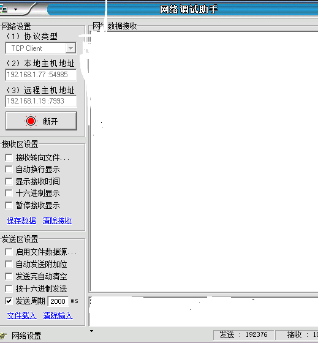
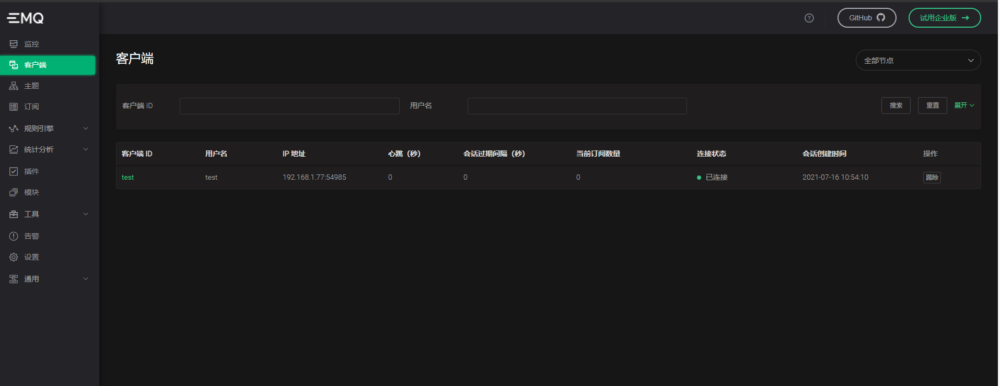
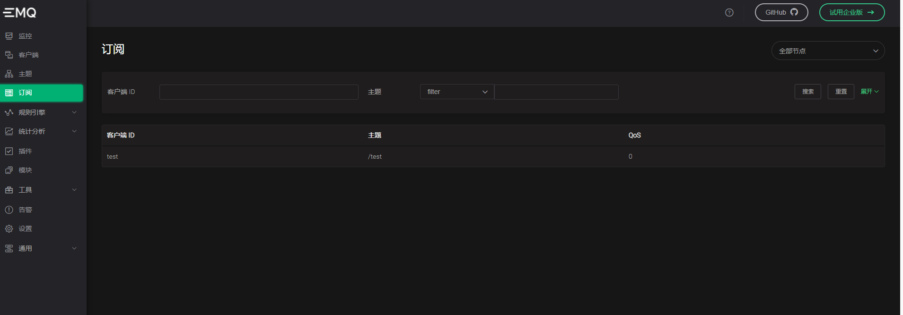
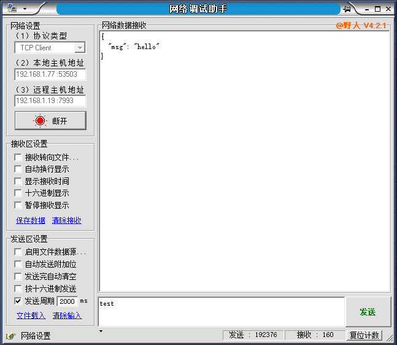
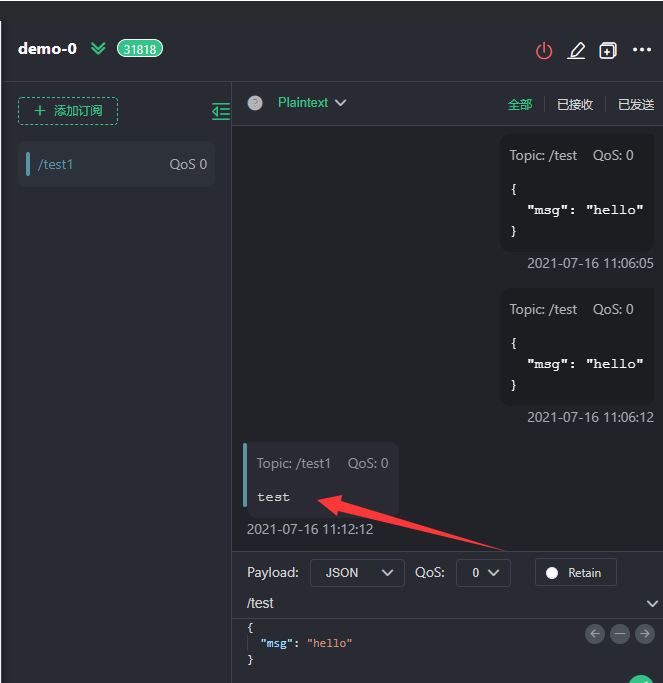

# Exproto-svr-java快速指南

[English](README.md) | 简体中文

## 前提

1. 仅支持开源版 4.3+。
2. JDK 1.8 +
3. 目前官方的4.3.0-4.3.5的版本尚存在bug，需要补丁。以下是加入补丁之后的Demo。
4. 如果你使用的时候，官方还没有修复bug，可将[补丁](https://github.com/emqx/emqx-extension-examples/tree/master/exproto-svr-python/patch/grpc_client.beam)放到你Emqx的lib/grpc-0.6.2/ebin下。

## 新建项目

首先新建一个普通 maven 项目

## 依赖配置

pom.xml 中依赖配置如下：

```xml
<?xml version="1.0" encoding="UTF-8"?>
<project xmlns="http://maven.apache.org/POM/4.0.0"
         xmlns:xsi="http://www.w3.org/2001/XMLSchema-instance"
         xsi:schemaLocation="http://maven.apache.org/POM/4.0.0 http://maven.apache.org/xsd/maven-4.0.0.xsd">
    <modelVersion>4.0.0</modelVersion>

    <groupId>org.example</groupId>
    <artifactId>exproto-svr-java</artifactId>
    <version>1.0-SNAPSHOT</version>
    <dependencies>
        <dependency>
            <groupId>io.grpc</groupId>
            <artifactId>grpc-netty-shaded</artifactId>
            <version>1.39.0</version>
        </dependency>
        <dependency>
            <groupId>io.grpc</groupId>
            <artifactId>grpc-protobuf</artifactId>
            <version>1.39.0</version>
        </dependency>
        <dependency>
            <groupId>io.grpc</groupId>
            <artifactId>grpc-stub</artifactId>
            <version>1.39.0</version>
        </dependency>
        <dependency> <!-- necessary for Java 9+ -->
            <groupId>org.apache.tomcat</groupId>
            <artifactId>annotations-api</artifactId>
            <version>6.0.53</version>
            <scope>provided</scope>
        </dependency>
        <dependency>
            <groupId>com.google.protobuf</groupId>
            <artifactId>protobuf-java-util</artifactId>
            <version>3.17.2</version>
        </dependency>
    </dependencies>
    <build>
        <extensions>
            <extension>
                <groupId>kr.motd.maven</groupId>
                <artifactId>os-maven-plugin</artifactId>
                <version>1.6.2</version>
            </extension>
        </extensions>
        <plugins>
            <plugin>
                <groupId>org.xolstice.maven.plugins</groupId>
                <artifactId>protobuf-maven-plugin</artifactId>
                <version>0.6.1</version>
                <configuration>
                    <protocArtifact>com.google.protobuf:protoc:3.17.2:exe:${os.detected.classifier}</protocArtifact>
                    <pluginId>grpc-java</pluginId>
                    <pluginArtifact>io.grpc:protoc-gen-grpc-java:1.39.0:exe:${os.detected.classifier}</pluginArtifact>
                </configuration>
                <executions>
                    <execution>
                        <goals>
                            <goal>compile</goal>
                            <goal>compile-custom</goal>
                        </goals>
                    </execution>
                </executions>
            </plugin>
        </plugins>
    </build>
</project>
```

## 代码生成

然后需要通过GRPC的协议规范文件来生成代码, 在此处获取: [exproto.proto](https://github.com/emqx/emqx/tree/master/apps/emqx_exproto/priv/protos) 最新版协议规范描述文件, 把 proto 文件复制到项目目录下和 java 目录平行的 proto 文件夹内, 然后运行命令:

```bash
mvn compile
```

或者直接在IDEA右侧选择MAVEN点击compile,同样的效果。

然后会在target目录下生成一系列目录，其中我们生成的代码在generated-sources

```
generated-sources
├── annotations
└── protobuf
    ├── grpc-java
    │   └──emqx
    │		└──exproto
    │		    └──v1
    │		    	├──ConnectionAdapterGrpc.java
    │   			└── ConnectionHandlerGrpc.java
    └── java
        └──emqx
    		└──exproto
   		    	└──v1
        			└── Exproto.java

```

到此为止我们的项目结构搭建成功，然后开始编写测试

## Demo

在src/main/java下新建包emqx.exproto.v1与上面生成的代码的包名保持一致。此参数是根据proto 文件中的 package 参数生成的。

ConnectionHandler.java

这里的HOST更换成你自己的EMQX服务器的IP。

```java
package emqx.exproto.v1;

import io.grpc.ManagedChannel;
import io.grpc.ManagedChannelBuilder;
import io.grpc.stub.StreamObserver;

import java.util.List;

/**
 * @author WangScaler
 * @date 2021/7/15 18:20
 */

public class ConnectionHandler extends ConnectionHandlerGrpc.ConnectionHandlerImplBase {
    private static final String HOST = "192.168.1.19:9100";
    static ManagedChannel channel;

    static {
        System.out.println("[LOG] Build singleton channel");
        channel = ManagedChannelBuilder
                .forTarget(HOST)
                .usePlaintext()
                .build();
    }

    @Override
    public StreamObserver<Exproto.SocketCreatedRequest> onSocketCreated(final StreamObserver<Exproto.EmptySuccess> responseObserver) {
        return new StreamObserver<Exproto.SocketCreatedRequest>() {
            public void onNext(Exproto.SocketCreatedRequest request) {
                ConnectionAdapterGrpc.ConnectionAdapterBlockingStub blockingStub = ConnectionAdapterGrpc.newBlockingStub(channel);
                System.out.println("[LOG] client socket connection:" + request.getConninfo());
                Exproto.ClientInfo clientInfo = Exproto.ClientInfo.newBuilder()
                        .setClientid("test")
                        .setUsername("test")
                        .build();
                Exproto.AuthenticateRequest authenticateRequest = Exproto.AuthenticateRequest.newBuilder()
                        .setClientinfo(clientInfo)
                        .setConn(request.getConn())
                        .setPassword("test")
                        .build();
                Exproto.CodeResponse response = blockingStub.authenticate(authenticateRequest);
                System.out.println("[LOG] authenticate" + response.getMessageBytes());
                Exproto.TimerRequest timerRequest = Exproto.TimerRequest.newBuilder()
                        .setConn(request.getConn())
                        .setInterval(20)
                        .setType(Exproto.TimerType.KEEPALIVE)
                        .build();
                Exproto.CodeResponse timerResponse = blockingStub.startTimer(timerRequest);
                System.out.println("[LOG] startTimer" + timerResponse.getMessageBytes());
                Exproto.SubscribeRequest subscribeRequest = Exproto.SubscribeRequest.newBuilder()
                        .setConn(request.getConn())
                        .setTopic("/test")
                        .setQos(0)
                        .build();
                Exproto.CodeResponse subscribeResponse = blockingStub.subscribe(subscribeRequest);
                System.out.println("[LOG] subscribe" + subscribeResponse.getMessageBytes());

            }

            public void onError(Throwable throwable) {
                System.out.println(" onSocketCreated error cause" + throwable.getCause());
                System.out.println(" onSocketCreated error message" + throwable.getMessage());
            }

            public void onCompleted() {
                responseObserver.onNext(Exproto.EmptySuccess.getDefaultInstance());
                responseObserver.onCompleted();
            }
        };
    }

    @Override
    public StreamObserver<Exproto.ReceivedBytesRequest> onReceivedBytes(final StreamObserver<Exproto.EmptySuccess> responseObserver) {
        return new StreamObserver<Exproto.ReceivedBytesRequest>() {
            public void onNext(Exproto.ReceivedBytesRequest request) {
                ConnectionAdapterGrpc.ConnectionAdapterBlockingStub blockingStub = ConnectionAdapterGrpc.newBlockingStub(channel);
                System.out.println("[LOG] ReceivedBytesRequest：" + request.getConn());
                Exproto.PublishRequest publishRequest = Exproto.PublishRequest.newBuilder()
                        .setConn(request.getConn())
                        .setTopic("/test1")
                        .setQos(0)
                        .setPayload(request.getBytes()).build();
                Exproto.CodeResponse response = blockingStub.publish(publishRequest);
                System.out.println("[LOG] publish" + response.getMessage());
            }

            public void onError(Throwable throwable) {
                System.out.println(" onReceivedBytes error cause" + throwable.getCause());
                System.out.println(" onReceivedBytes error message" + throwable.getMessage());
            }

            public void onCompleted() {
                responseObserver.onNext(Exproto.EmptySuccess.getDefaultInstance());
                responseObserver.onCompleted();
            }
        };
    }

    @Override
    public StreamObserver<Exproto.ReceivedMessagesRequest> onReceivedMessages(final StreamObserver<Exproto.EmptySuccess> responseObserver) {
        return new StreamObserver<Exproto.ReceivedMessagesRequest>() {
            public void onNext(Exproto.ReceivedMessagesRequest receivedMessagesRequest) {
                ConnectionAdapterGrpc.ConnectionAdapterBlockingStub blockingStub = ConnectionAdapterGrpc.newBlockingStub(channel);
                System.out.println("[LOG] onReceivedMessages：" + receivedMessagesRequest.getConn());
                List<Exproto.Message> messagesList = receivedMessagesRequest.getMessagesList();
                for (Exproto.Message message : messagesList) {
                    System.out.println("Message:" + message.getPayload());
                    Exproto.SendBytesRequest sendBytesRequest = Exproto.SendBytesRequest.newBuilder()
                            .setConn(receivedMessagesRequest.getConn())
                            .setBytes(message.getPayload())
                            .build();
                    Exproto.CodeResponse sendBytesResponse = blockingStub.send(sendBytesRequest);
                    System.out.println("[LOG] sendBytes" + sendBytesResponse.getMessage());

                }

            }

            public void onError(Throwable throwable) {
                System.out.println(" onReceivedMessages error cause" + throwable.getCause());
                System.out.println(" onReceivedMessages error message" + throwable.getMessage());
            }

            public void onCompleted() {
                responseObserver.onNext(Exproto.EmptySuccess.getDefaultInstance());
                responseObserver.onCompleted();
            }
        };
    }

    @Override
    public StreamObserver<Exproto.TimerTimeoutRequest> onTimerTimeout(final StreamObserver<Exproto.EmptySuccess> responseObserver) {
        return new StreamObserver<Exproto.TimerTimeoutRequest>() {
            public void onNext(Exproto.TimerTimeoutRequest timerTimeoutRequest) {
                ConnectionAdapterGrpc.ConnectionAdapterBlockingStub blockingStub = ConnectionAdapterGrpc.newBlockingStub(channel);
                System.out.println("[LOG] onTimerTimeout");
                Exproto.CloseSocketRequest closeSocketRequest = Exproto.CloseSocketRequest.newBuilder()
                        .setConn(timerTimeoutRequest.getConn())
                        .build();
                Exproto.CodeResponse closeResponse = blockingStub.close(closeSocketRequest);
                System.out.println("[LOG] close" + closeResponse.getMessage());
            }

            public void onError(Throwable throwable) {
                System.out.println(" onTimerTimeout error cause" + throwable.getCause());
                System.out.println(" onTimerTimeout error message" + throwable.getMessage());
            }

            public void onCompleted() {
                responseObserver.onNext(Exproto.EmptySuccess.getDefaultInstance());
                responseObserver.onCompleted();
            }
        };
    }

    @Override
    public StreamObserver<Exproto.SocketClosedRequest> onSocketClosed(final StreamObserver<Exproto.EmptySuccess> responseObserver) {
        return new StreamObserver<Exproto.SocketClosedRequest>() {
            public void onNext(Exproto.SocketClosedRequest socketClosedRequest) {
                System.out.println("[LOG] onSocketClosed:" + socketClosedRequest.toString());
            }

            public void onError(Throwable throwable) {
                System.out.println(" onSocketClosed error cause" + throwable.getCause());
                System.out.println(" onSocketClosed error message" + throwable.getMessage());
            }

            public void onCompleted() {
                responseObserver.onNext(Exproto.EmptySuccess.getDefaultInstance());
                responseObserver.onCompleted();
            }
        };
    }
}
```

TestGrpcServer.java

这里使用`NettyServerBuilder.permitKeepAliveTime(2, TimeUnit.SECONDS)`的原因是如果不设置的话，设备发送三分钟会出现断开现象，通过抓包发现`too_many_pings`，并且通过[A8-client-side-keepalive](https://github.com/grpc/proposal/blob/master/A8-client-side-keepalive.md#server-enforcement)发现是GRPC的一种机制。可参考[tcp keepalive](https://askemq.com/t/topic/684)

```java
package emqx.exproto.v1;

import io.grpc.Server;
import io.grpc.ServerBuilder;
import io.grpc.netty.shaded.io.grpc.netty.NettyServerBuilder;


import java.io.IOException;
import java.util.concurrent.TimeUnit;
import java.util.logging.Logger;

public class TestGRpcServer {

    private static final Logger logger = Logger.getLogger(TestGRpcServer.class.getName());

    public static void main(String[] args) throws IOException, InterruptedException {
        int port = 9001;
        Server server = NettyServerBuilder
                .forPort(9001)
                .permitKeepAliveTime(2, TimeUnit.SECONDS)
                .permitKeepAliveWithoutCalls(true)
                .addService(new ConnectionHandler())
                .build()
                .start();
        logger.info("Server started, listening on " + port);
        server.awaitTermination();
    }
}
```

最终的目录结构

```
├── pom.xml
├── src
│   ├── main
│   │   ├── java
│   │   │   └── emqx
│   │   │       └── exproto
│   │   │           └── v1
│   │   │               ├── ConnectionHandler.java
│   │   │               └── TestGRpcServer.java
│   │   ├── proto
│   │   │   └── exproto.proto
│   │   └── resources
│   └── test
│       └── java
├── target
	└──generated-sources
        ├── annotations
        └── protobuf
            ├── grpc-java
            │   └──emqx
            │		└──exproto
            │		    └──v1
            │		    	├──ConnectionAdapterGrpc.java
            │   			└── ConnectionHandlerGrpc.java
            └── java
                └──emqx
                    └──exproto
                        └──v1
                            └── Exproto.java

```

## 测试过程

我这里使用的网络调试助手进行的测试，可以选择你自己的方式去连接，EMQX服务器的IP:192.168.1.19

### 连接



控制台输出

```
[LOG] client socket connection:peername {
  host: "192.168.1.77"
  port: 54985
}
sockname {
  host: "192.168.1.19"
  port: 7993
}
```

### 认证

控制台输出

```
[LOG] authenticate code: 0
```

此时观察Dashboard



证明认证成功

### 订阅

控制台输出

```
LOG] subscribe  code: 0
```

此时在Dashboard也可观察到

证明订阅成功，当我们向该主题发送消息的时候，控制台输出

```
[LOG] onReceivedMessages：g1hkAA5lbXF4QDEyNy4wLjAuMQAAE/8AAAABAAAAAQ==
Message:<ByteString@36abb5d4 size=20 contents="{\n  \"msg\": \"hello\"\n}">
[LOG] sendBytes code: 0

```

同时我们的网络助手也接收到了消息



### 开启定时器

控制台输出

```
[LOG] startTimer code: 0
```

当超过我们设置的时间Interval(20）* 3=60s时将触发回调OnTimerTimeout。

```
[LOG] onTimerTimeout
[LOG] close code: 0
```

### 发布

当我们使用网络调试助手发送消息(test)时，控制台输出

```
[LOG] ReceivedBytesRequest：g1hkAA5lbXF4QDEyNy4wLjAuMQAAFDwAAAABAAAAAQ==
[LOG] publish  code: 0
```

而我们的订阅者，也可以订阅到消息



### 关闭

控制台打印

```
[LOG] onSocketClosed:conn: "g1hkAA5lbXF4QDEyNy4wLjAuMQAAFDwAAAABAAAAAQ=="
reason: "{shutdown,{sock_closed,normal}}"
```

## 参考资料

- [1] [exproto-svr-java-for-enterpise-e4.2](https://github.com/emqx/emqx-extension-examples/tree/master/exproto-svr-java-for-enterpise-e4.2)
- [2] [gRpc.io](https://www.grpc.io/docs/languages/python/quickstart/)
- [3] [A8-client-side-keepalive](https://github.com/grpc/proposal/blob/master/A8-client-side-keepalive.md#server-enforcement)

## 注意：这里的StartTimer的意义是如果监测到我们的tcp连接interval*3s没有发送数据，就会回调OnTimerTimeout函数，我们可以在这里处理一些业务，我这里将tcp连接直接踢掉。