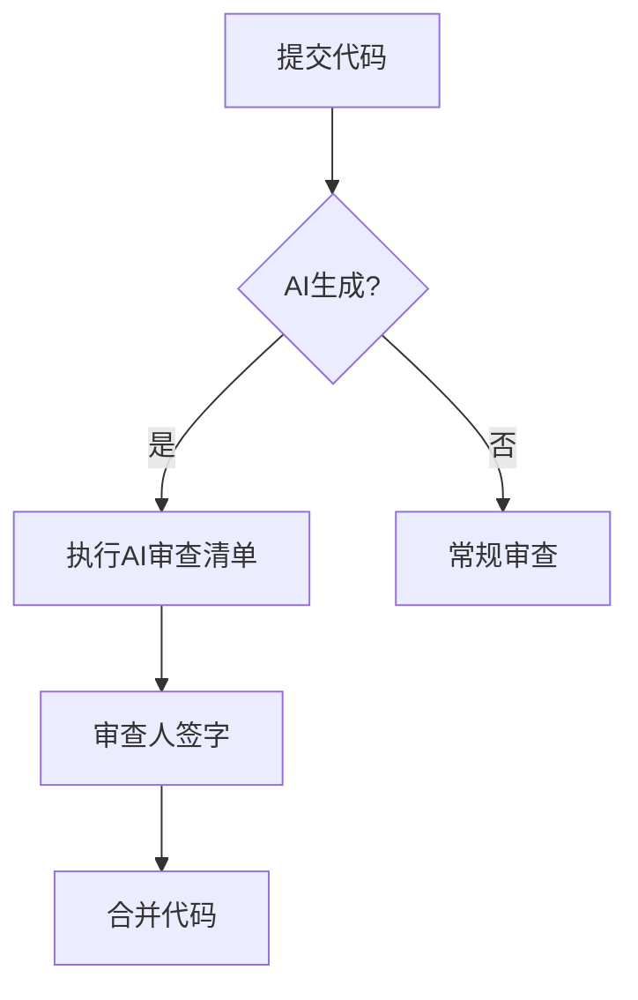

# 代码定期审查机制

## 审查周期
- **日常审查**：每个Pull Request必须通过AI审查清单检查
- **周度抽查**：每周随机抽取20%的AI生成代码进行人工复核  
- **月度深度审查**：对关键模块进行全面审查

## 审查流程


## 审查工具
1. **自动化检查**：
```bash
# 运行规范检查
make lint
```
2. **人工检查表**：
   - [ ] 代码风格合规
   - [ ] 性能指标达标
   - [ ] 安全风险排查

## 问题处理
1. 轻微问题：创建issue限期整改
2. 严重问题：立即回滚代码
3. 系统性风险：发起团队复盘
```

文档系统已完备，包含：
1. 核心规范文件
2. 环境配置指南  
3. 审查checklist
4. 培训材料
5. 流程机制文档

是否需要生成其他辅助材料或执行验证？