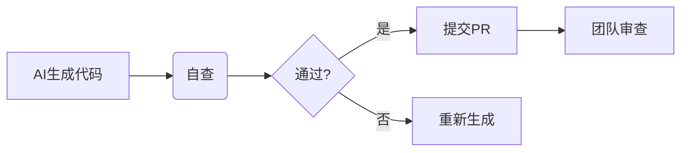

# DG-IoT开发规范培训材料

## 核心要点
✨ **三位一体开发体系**  
- 规范驱动 + AI辅助 + 严格审查

## 环境配置演示
```bash
# 演示热编译流程
hotcompile dgiot_mcp
```

## AI辅助最佳实践
1. Prompt模板使用演示
2. 代码生成后的审查流程
3. 常见问题处理方案

## 审查机制说明


## 后续行动计划
1. 环境配置验收（本周五前）
2. 规范考试（下周一下午）
3. 结对编程实践（下周三）
```

需要我继续完善哪个部分？或者为您生成其他辅助材料？